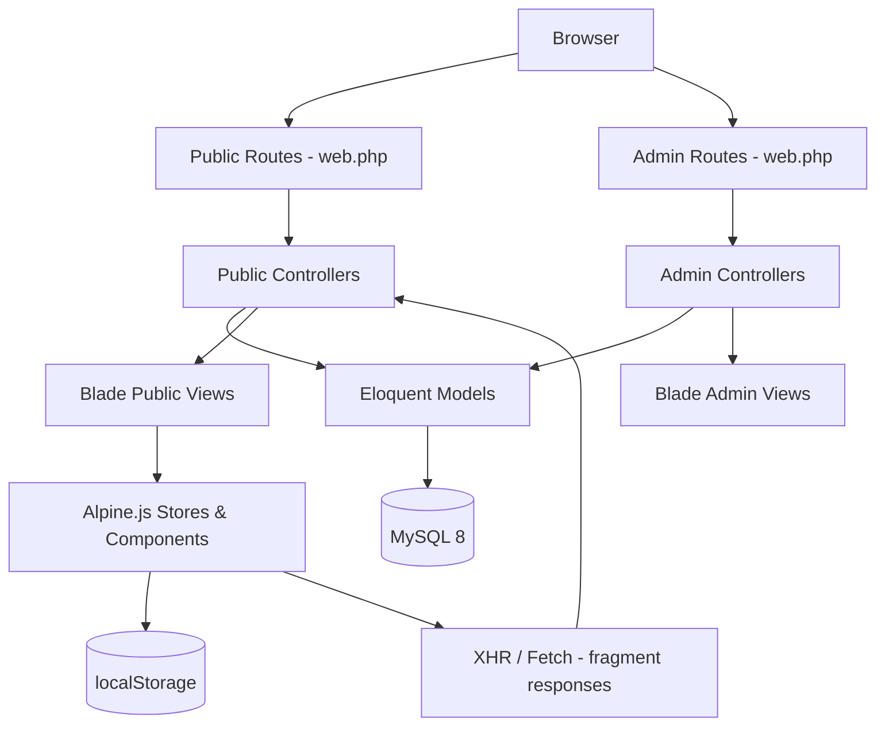
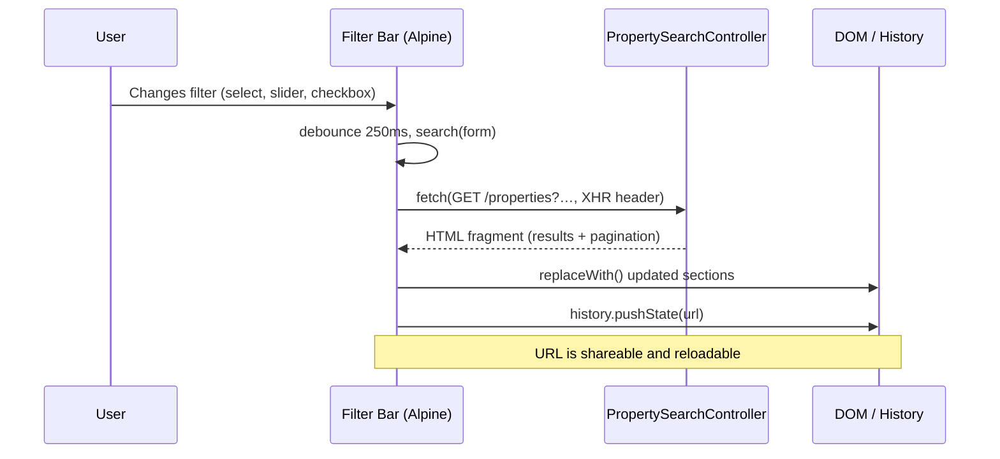

# Design Document: Urban Haven — Product Quality & UX Excellence Pass

## Overview

Urban Haven is a Laravel 13 / PHP 8.4 real-estate platform for the Dhaka market, serving a public property-browsing site and a staff admin panel. The core feature set — property listings, search, shortlist, compare, enquiry capture, CMS, and a full lead/visit/CRM workflow — is substantially complete. The intent of this pass is not to redesign anything; it is to systematically find and repair every place where the existing implementation falls short of professional, production-ready quality.

This document maps the full architecture, identifies the specific quality gaps observed in the codebase audit, and prescribes the exact changes needed. Every recommendation stays strictly within the existing stack (Blade, Alpine.js, Tailwind 4, Laravel 13, PHPUnit) and preserves all approved layouts, component shapes, and data contracts.

The pass is scoped to five domains: (1) public search & property UX, (2) property detail & gallery, (3) shortlist/compare/account, (4) admin CRM & visit workflows, and (5) cross-cutting concerns — forms, accessibility, responsive behaviour, and error/loading states.

---

## Architecture

The application follows a standard Laravel MVC structure. The frontend is Blade + Alpine.js with Tailwind 4 utility classes compiled by Vite. There is no separate API layer; AJAX uses `X-Requested-With: XMLHttpRequest` and the same controllers that serve full pages also return HTML fragments for progressive enhancement. Client-side state (shortlist, compare, recently viewed) lives entirely in `localStorage` via the `$store.saved` Alpine store.



### Key Subsystems

| Subsystem | Entry point | Key files |
|---|---|---|
| Public property search | `PropertySearchController` | `public/properties/index.blade.php`, `partials/filter-bar.blade.php`, `partials/filter-drawer.blade.php` |
| Property detail | `PropertyController::show` | `public/properties/show.blade.php` |
| Homepage | `HomeController` | `public/home.blade.php`, `public/home/*` |
| Shortlist / Compare | `ShortlistController` | `public/shortlist.blade.php`, `public/compare.blade.php`, `partials/saved-*.blade.php` |
| Enquiry / Lead capture | `LeadController` | `partials/lead-form.blade.php`, `partials/property-preview.blade.php` |
| Admin CRM | `LeadController`, `SiteVisitController` | `admin/leads/*`, `admin/visits/index.blade.php` |
| Admin property form | `PropertyController` | `admin/properties/_form.blade.php` |
| Public layout | — | `layouts/public.blade.php` |
| Admin layout | — | `layouts/admin.blade.php` |
| Design tokens | — | `resources/css/app.css` (`@theme` block) |

---

## Sequence Diagrams

### Public Property Search — Filter Change



### Lead Enquiry Submission

```mermaid
sequenceDiagram
    participant U as User
    participant Form as uhLeadForm (Alpine)
    participant Server as LeadController::store

    U->>Form: Fills form, submits
    Form->>Form: start() records engagement time
    Form->>Server: POST /inquiries (JSON)
    Server->>Server: Validate; check duplicate within 60s window
    Server-->>Form: {success, message} or {errors}
    alt Success
        Form->>Form: done = true; show success message
    else Validation error
        Form->>Form: show fieldError(name) messages
    else Network error
        Form->>Form: show error alert
    end
```

### Admin Lead Stage Transition

```mermaid
sequenceDiagram
    participant Staff as Staff User
    participant LeadShow as Lead Detail Page
    participant Server as LeadController::updateStatus

    Staff->>LeadShow: Selects new stage from status widget
    LeadShow->>Server: PUT /admin/leads/{id}/status
    Server->>Server: Authorise (assigned or owner)
    Server->>Server: Validate allowed transition
    Server->>Server: Persist; log audit entry
    Server-->>LeadShow: Redirect with flash
    note over Server: Closing as Lost requires loss_reason
```

---

## Components and Interfaces

### 1. Filter Bar (`partials/filter-bar.blade.php`)

**Purpose**: Primary search interface — purpose toggle, location multi-select, price range, property type picker, map link, advanced-filter toggle.

**Current gaps**:
- The Property Status popover directly manipulates a hidden input by raw `document.querySelector` selector. This is brittle; the listing_type input is already bound via `x-ref="status"`, so it should be used instead.
- The "Any status" button inside the status popover dispatches `uh-listing-purpose` with `detail: 'sale'` even when clearing to "any", which incorrectly snaps the price range to the sale stops.
- `@change.debounce.250ms` on the form fires on every `<input>` inside the form including range slider `mousemove` events, sending many redundant requests; should gate on blur/change for text inputs.

**Interface** (Alpine component `uhBrowse`):
```pascal
PROCEDURE search(form)
  INPUT: form element
  OUTPUT: side-effects — DOM update, history.pushState

PROCEDURE toggleFilters()
  POSTCONDITION: filtersOpen toggled; body scroll locked when open

PROCEDURE openPreview(payload)
  POSTCONDITION: preview modal shown with correct property data
```

### 2. Property Card (`partials/property-card.blade.php` + `showcase-slide.blade.php`)

**Purpose**: Reusable listing tile used on homepage carousels, search results, and shortlist.

**Current gaps**:
- `showcase-slide` uses `$amenityCatalog->get($amenityId)?->label` but the variable `$amenityCatalog` is only passed from `index.blade.php`; it is `null` on the homepage carousel, causing silent PHP notices.
- `property-card` price overlay (`uh-listing-image-price`) has no background scrim on images with light tops — text becomes unreadable.
- The `is-on` photo class on `showcase-slide` uses `:class="{ 'is-on': photoOn(…) }"` but the static `@class(['is-on' => $photoIndex === 0])` is also present, doubling classes in some states.

### 3. Property Detail (`public/properties/show.blade.php`)

**Purpose**: Full property page — gallery, overview, description, amenities, units, floor plans, brochures, contact form, similar properties.

**Current gaps**:
- The `uh-pd-tabs-strip` uses `data-active` to indicate the current tab but the CSS selector is `:data-active` which requires Tailwind's arbitrary variant; this is non-standard and should use a class (`is-active`) or `aria-current` for clarity and wider browser support.
- The gallery "View all photos" button (`uh-pd-gallery-all`) is positioned absolutely inside `.uh-pd-gallery` but the parent has `overflow: hidden` in some viewport widths — the button clips.
- Floor plan `<a>` tags link to `$plan->url()` (full resolution) but there is no `rel="noopener"` on the `target="_blank"` link.
- The `$thumbs = $media->slice(1, 2)` calculation uses array keys, not re-indexed values; on some media collections with gaps, `$loop->index` inside the foreach is non-contiguous, breaking `open({{ $index + 1 }})` calls.

**Interface** (`uhGallery` Alpine component):
```pascal
PROCEDURE open(index)
  PRECONDITION: 0 ≤ index < count
  POSTCONDITION: lightbox = true; active = index; body scroll locked

PROCEDURE close()
  POSTCONDITION: lightbox = false; body scroll unlocked

PROCEDURE next() / previous()
  POSTCONDITION: active wraps within [0, count)
```

### 4. Shortlist & Compare (`public/shortlist.blade.php`, `public/compare.blade.php`)

**Purpose**: Client-side saved property lists backed by localStorage; cards loaded on-demand from the server.

**Current gaps**:
- `uhSavedList` calls `load()` on every `$watch` change, including when the count has not changed (e.g. a `prune()` call that removes nothing). This causes a flicker on pages that don't need it.
- The shortlist "Clear all" `confirm()` dialog text is a bare JS string; it should use the `uhCopy` system for i18n.
- Compare page shows an empty state when `count < 2` but the condition `count >= 2 && html` drives the content div — if `html` is populated from a previous load and `count` drops to 1 (item removed), the content area remains visible until the next reload.

### 5. Lead Form (`partials/lead-form.blade.php`)

**Purpose**: Shared enquiry form used on property detail, project pages, and contact page.

**Current gaps**:
- Phone field has `dir="ltr"` and `inputmode="tel"` but no `pattern` or client-side validation hint. A Bangladeshi mobile starts with `01` and has 11 digits; the form accepts any string.
- The `consent_given` checkbox error message is rendered via both `@error('consent_given')` (server) and `x-show="fieldError('consent_given')"` (Alpine); on a full-page POST fallback, both render at the same time, duplicating the message.
- `uhLeadForm` does not handle HTTP 429 (rate-limit) responses differently from generic errors; users see a confusing "We could not send" message when they should see "Too many requests, try again shortly."

**Interface** (`uhLeadForm` Alpine component):
```pascal
PROCEDURE submit(event)
  PRECONDITION: form fields are present; CSRF token is valid
  POSTCONDITION: on 2xx → done = true, message set
                 on 4xx validation → fieldErrors populated
                 on 429 → error = rate limit message
                 on network error → error = offline/error message

PROCEDURE fieldError(name)
  OUTPUT: first error string for the named field, or null
```

### 6. Admin Property Form (`admin/properties/_form.blade.php`)

**Purpose**: Multi-section compose form for creating and editing property listings.

**Current gaps**:
- The reservation expiry `datetime-local` input in the availability panel is rendered unconditionally but only displayed via `x-cloak / x-show="value === 'reserved'"`. The hidden input always submits its value even when the status is not "reserved", causing the model to receive a `reservation_expires_at` it should ignore.
- `@disabled(! $canEdit)` on the outer fieldset correctly disables form controls but the submit button inside `.uh-admin-dock` is outside the fieldset, so it remains enabled and can be clicked when `$canEdit = false`.
- The "Save draft / Save changes" button text does not distinguish between owner-publish and editor-draft-submit; editors see "Save changes" which implies a publish.

### 7. Admin Leads (`admin/leads/index.blade.php`, `admin/leads/show.blade.php`)

**Purpose**: CRM table and detail view for managing enquiry leads through a 7-stage pipeline.

**Current gaps** (index):
- Overdue indicator on the "Overdue" tab badge (`$overdueCount`) is pre-loaded; after filtering it no longer refreshes, so the badge stays stale.
- The lead table row `<tr class="uh-admin-clickrow">` pattern relies on JS to make the row clickable but no JS is wired to the class in the compiled bundle — clicking the row itself does nothing. The "Open" action button is the only real affordance.

**Current gaps** (show — not yet read but inferred from controller):
- The lead show page is the most critical and complex admin view. Audit will confirm inline.

### 8. Admin Site Visits (`admin/visits/index.blade.php`)

**Purpose**: Viewing request management — confirm slot, mark completed with outcome note.

**Current gaps**:
- The inline status update form has `<template x-if="status === 'completed'">` for the textarea but `required` is bound as `:required="status === 'completed'"`. This works but when Alpine swaps the template in, the required attribute is not live until the next Alpine tick — the form can submit an empty outcome note for "completed" on a fast click.
- There is no inline confirmation before submitting a status transition that can't be reversed (e.g. marking "completed"). One stray click finalises a visit.

---

## Data Models

### Property (key fields for quality pass)

```pascal
STRUCTURE Property
  id: Integer (PK)
  title: String(255)
  slug: String(255)
  listing_type: Enum('sale', 'rent')
  availability: Enum('available', 'reserved', 'sold', 'let', 'off_market')
  price: Integer|null
  price_mode: Enum('fixed', 'on_request')
  price_basis: String|null
  area_value: Decimal|null
  area_unit: String
  bedrooms: Integer|null
  bathrooms: Integer|null
  is_featured: Boolean
  lat: Decimal|null
  lng: Decimal|null
  version: Integer   -- optimistic locking
  reservation_expires_at: Timestamp|null
END STRUCTURE
```

### Lead (key fields for quality pass)

```pascal
STRUCTURE Lead
  id: Integer (PK)
  name: String
  phone: String
  email: String|null
  status: Enum('new','contacted','qualified','negotiating','won','lost','unqualified')
  priority: Enum('low','normal','high','urgent')
  is_unread: Boolean
  is_repeat_contact: Boolean
  next_action_at: Timestamp|null
  assigned_to: Integer|null  -- FK staff user
  submission_token: UUID     -- dedup key
  loss_reason: String|null   -- required when status = 'lost'
END STRUCTURE
```

### SiteVisitRequest (transitions)

```pascal
TRANSITIONS = {
  'pending'   → ['confirmed', 'cancelled'],
  'confirmed' → ['completed', 'no_show', 'cancelled'],
  -- terminal: completed, no_show, cancelled
}
```

---

## Algorithmic Pseudocode

### Lead Deduplication

```pascal
ALGORITHM isRepeatSubmission(phone, email, propertyId, windowSeconds)
  INPUT: phone, email, propertyId (nullable), windowSeconds = 60
  OUTPUT: existingLead | null

  SEQUENCE
    cutoff ← now() - windowSeconds seconds
    query ← Lead.where('phone', phone)
                 .where('created_at', '>=', cutoff)
    IF propertyId IS NOT NULL THEN
      query ← query.where('property_id', propertyId)
    END IF
    RETURN query.first()
  END SEQUENCE
END ALGORITHM
```

### Property Publish Checklist Validation

```pascal
ALGORITHM canPublish(property)
  INPUT: property of type Property
  OUTPUT: {canPublish: Boolean, failures: Array<String>}

  SEQUENCE
    failures ← []
    IF property.reference IS NULL THEN failures.push('Missing reference') END IF
    IF property.price IS NULL AND property.price_mode = 'fixed' THEN failures.push('Missing price') END IF
    IF property.area_value IS NULL THEN failures.push('Missing size') END IF
    IF property.galleryImages().isEmpty() THEN failures.push('No photos') END IF
    FOREACH photo IN property.galleryImages() DO
      IF photo.alt(locale).isEmpty() THEN failures.push('Photo missing alt text') END IF
    END FOREACH
    RETURN { canPublish: failures.isEmpty(), failures: failures }
  END SEQUENCE
END ALGORITHM
```

---

## Key Functions with Formal Specifications

### `uhBrowse.search(form)`

**Preconditions:**
- `form` is an HTMLFormElement with `id="property-filters"`
- `form.action` resolves to a valid route URL
- No in-flight request is still pending (or the previous is aborted)

**Postconditions:**
- DOM sections `.uh-results-bar`, `.uh-active-filters`, `.uh-workspace` are replaced with the server response equivalents
- `window.location.href` reflects the new search URL
- `submitting` is `false` on completion (success or error)
- On network failure: `window.location.assign(url)` is called (hard fallback)

**Loop Invariants:** N/A (single async operation)

---

### `registerSavedStore.toggle(list, id)`

**Preconditions:**
- `list` ∈ {`shortlist`, `compare`, `recent`}
- `id` is a positive integer
- `LIMITS[list]` is defined

**Postconditions:**
- If id was present: removed from `this[list]`; notice = removal message
- If id was absent and list is not full: id appended; notice = add message
- If id was absent and list is full: notice = limit message; no mutation
- `write(KEYS[list], this[list])` is called (best-effort; storage failure sets notice)

**Loop Invariants:** N/A

---

### `uhLeadForm.submit(event)`

**Preconditions:**
- `event.target` is a valid HTML form with all required hidden inputs
- CSRF token is present and valid
- Network is available

**Postconditions:**
- On HTTP 2xx: `done = true`; `message` set from response body
- On HTTP 4xx with `errors` key: `fieldErrors` populated; `done = false`
- On HTTP 422: form highlighted fields shown
- On HTTP 429: `error` = rate-limit copy
- On network/offline: `error` = offline copy
- `submitting = false` in all exit paths

---

## Example Usage

### Searching properties with filters active

```pascal
SEQUENCE
  user opens /properties?listing_type=sale&min_beds=2&location_area_ids[]=5
  FilterBar shows: "For sale" active, location "Gulshan" chip, "2+ beds" in drawer
  User changes price max to 5000000
  FilterBar.search(form) fires after 250ms debounce
  DOM updates in-place; URL changes to include max_price=5000000
  Shareable link now reproduces identical results
END SEQUENCE
```

### Submitting an enquiry from a property page

```pascal
SEQUENCE
  user fills name, phone, optional email, message
  user checks consent
  user clicks "Send enquiry"
  uhLeadForm.submit fires; button shows spinner
  Server validates; checks dedup window
  IF duplicate within 60s THEN
    server returns success with repeat notice
  ELSE
    new Lead created; notification job dispatched
  END IF
  form replaced by success message; "View your activity" link shown if logged in
END SEQUENCE
```

### Admin moving a lead from "Qualified" to "Lost"

```pascal
SEQUENCE
  staff opens lead; status = 'qualified'
  staff clicks stage selector, picks "Lost"
  form reveals loss_reason textarea (required)
  staff enters reason; submits
  Server validates transition is allowed (qualified → lost ✓)
  Server validates loss_reason is present
  Lead.status = 'lost'; audit log entry created
  Redirect with flash "Lead closed as lost"
END SEQUENCE
```

---

## Correctness Properties

*A property is a characteristic or behavior that should hold true across all valid executions of a system — essentially, a formal statement about what the system should do. Properties serve as the bridge between human-readable specifications and machine-verifiable correctness guarantees.*

### P1 — Filter URL Round-Trip

For any combination of valid filter parameters `F`, applying `F` to the search form and reloading the resulting URL must produce the same results as the original query.

```pascal
PROPERTY filterRoundTrip
  FOR ALL F IN validFilterCombinations DO
    url1 ← applyFilters(F)
    results1 ← fetchResults(url1)
    url2 ← reload(url1)
    results2 ← fetchResults(url2)
    ASSERT results1 = results2
  END FOR
END PROPERTY
```

**Validates: Requirements 2.1, 2.2**

### P2 — Lead Deduplication Idempotency

For any lead submission `S` within the dedup window, submitting `S` twice within 60 seconds must create exactly one lead, not two.

```pascal
PROPERTY leadDedup
  FOR ALL S IN validLeadSubmissions DO
    lead1 ← submit(S)
    lead2 ← submit(S, within: 60 seconds)
    ASSERT Lead.count() increased by exactly 1
    ASSERT lead2.is_repeat_contact = true OR lead2.id = lead1.id
  END FOR
END PROPERTY
```

**Validates: Requirements 8.1, 8.2**

### P3 — Saved Store Limit Enforcement

For any list `L` with limit `N`, after `N + k` add operations (k ≥ 1), the list length must not exceed `N` and the last `k` additions must have been rejected with a notice.

```pascal
PROPERTY savedStoreLimit
  FOR ALL L IN {shortlist, compare} DO
    ASSERT |L| ≤ LIMITS[L] after any sequence of toggles
  END FOR
END PROPERTY
```

**Validates: Requirements 6.4**

### P4 — Lead Stage Transition Validity

For any lead in state `s`, only transitions in `Lead::TRANSITIONS[s]` are accepted by the server; all other transitions return HTTP 422.

```pascal
PROPERTY leadTransitionFSM
  FOR ALL s IN Lead.STATUSES DO
    FOR ALL t IN Lead.STATUSES DO
      IF t NOT IN TRANSITIONS[s] THEN
        ASSERT PUT /admin/leads/{id}/status {status: t} returns 422
      END IF
    END FOR
  END FOR
END PROPERTY
```

**Validates: Requirements 10.3**

### P5 — Publish Checklist Completeness

A property that is missing any required field (reference, price or price_mode=on_request, area_value, at least one gallery image with alt text) must not be publishable through the publication panel.

```pascal
PROPERTY publishChecklist
  FOR ALL P IN properties WHERE NOT meetPublishRequirements(P) DO
    ASSERT POST /admin/publications/properties/{id}/publish returns 422
  END FOR
END PROPERTY
```

**Validates: Requirements 12.1, 12.2, 12.3, 12.4, 12.5**

### P6 — Gallery Navigation Wraps Within Bounds

For any gallery with `n` photos, calling `next()` from the last photo and `previous()` from the first photo must wrap correctly within `[0, n)`.

*For any* gallery state with `n ≥ 1` photos, `next()` called when `active = n - 1` must produce `active = 0`, and `previous()` called when `active = 0` must produce `active = n - 1`.

**Validates: Requirements 5.3, 5.4**

### P7 — LeadForm Submit Postconditions

For any HTTP response status code returned by the server, the `uhLeadForm` component must transition to the correct client state as defined by its postcondition contract.

*For any* form submission, the `done`, `fieldErrors`, `error`, and `submitting` state variables must match the contract: 2xx → `done = true`; 4xx with errors → `fieldErrors` populated; 429 → rate-limit error message; network failure → offline error message; all paths → `submitting = false`.

**Validates: Requirements 7.3, 7.4, 7.5, 7.6, 7.7**

### P8 — Reservation Expiry Submission Guard

For any property form submission where `availability` is not `'reserved'`, the `reservation_expires_at` field must not be included in the submitted payload.

*For any* form submission with `status ≠ 'reserved'`, the server SHALL NOT receive or persist a `reservation_expires_at` value.

**Validates: Requirements 9.1**

---

## Error Handling

### Public Search — Zero Results

**Condition**: Active filters produce no results  
**Response**: `x-ui.empty` component renders with "Nothing matches this search yet" title and contextual suggestions  
**Recovery**: "Try removing" chips and "Clear all" link visible; "Adjust filters" button opens filter drawer

### Public Search — Network Failure During Filter Change

**Condition**: Fetch request for updated results fails (timeout, offline, 5xx)  
**Response**: `catch` block in `uhBrowse.search` falls back to `window.location.assign(url)` — full page load at the new URL  
**Recovery**: Standard browser error page if server is down; otherwise full page results load

### Property Gallery — No Photos

**Condition**: `$media->isEmpty()`  
**Response**: Placeholder `div.uh-pd-shot.is-main.is-empty` shown with icon and "Photos coming soon" text  
**Recovery**: No user action required; auto-resolves when admin uploads photos

### Lead Form — Rate Limited

**Condition**: Server returns HTTP 429  
**Response**: `error` message set to rate-limit copy string; submit button re-enabled  
**Recovery**: User can retry after the cooldown period; message should communicate this

### Admin Form — Stale Version Conflict

**Condition**: Two staff users edit the same property simultaneously; second save triggers `StaleRecordException`  
**Response**: Flash error "This record was updated by someone else. Reload and re-apply your changes."  
**Recovery**: User reloads, sees current state, re-applies their changes

---

## Testing Strategy

### Unit Testing

Target isolated logic with no HTTP context:
- `MoneyFormatter::compactBdt()` — edge cases: 0, negative, exactly 1 lakh, exactly 1 crore, fractional crore
- `AreaConverter::format()` — all supported units round-trip
- `PropertyStory::facts()` — plot type suppresses bed/bath facts; all combinations
- `PhoneNumber::whatsappHref()` — valid and missing numbers
- Lead dedup window boundary: submission at t=59s (deduplicated) vs t=61s (new lead)

### Property-Based Testing

**Library**: PHPUnit with manual generators (no external PBT library currently installed; use data providers with randomised ranges as a lightweight alternative)

- Filter URL round-trip: generate random valid filter bags, apply, reload, assert identity *(P1)*
- Lead FSM: for each status, assert only valid next-states are accepted *(P4)*
- Saved store limits: fuzz add/remove sequences, assert `|list| ≤ LIMIT` invariant *(P3)*

### Feature (Integration) Testing

Priority test cases for this pass:

1. **Property search returns correct results** — filters independently and in combination
2. **Enquiry deduplication** — same phone within 60s → one lead, second marked repeat
3. **Lead stage transitions** — all valid and invalid transitions via HTTP
4. **Lead closing as Lost requires loss_reason** — missing reason returns 422
5. **Site visit status transitions** — confirm requires `confirmed_at`; complete requires `outcome_note`
6. **Publish checklist enforced** — attempt to publish incomplete property is rejected
7. **Shortlist/compare empty states** — no items → empty component renders
8. **Admin role boundaries** — sales user cannot access another user's leads; editor cannot publish

### Accessibility Checks (Manual / Blade assertions)

- Every interactive element has a visible label or `aria-label`
- Focus is trapped within open modals/drawers
- Alerts use `role="alert"` or `aria-live="polite"`
- Skip link renders and targets `#main`
- Gallery lightbox receives focus on open; returns focus on close

---

## Performance Considerations

- `showcase-slide` pre-loads up to 5 images per card; on the homepage with 6+ featured properties this is 30 images. All but the first card's first image are `loading="lazy"` — confirmed present in current code. No change needed.
- Filter debounce is 250ms for select/checkbox changes. Range slider `@change` should remain 250ms; `@input.debounce.500ms` on the range inputs (if added) should use a longer delay to avoid per-tick fetches.
- The `$store.saved` watch in `uhSavedList` triggers a full re-fetch on every store mutation. This is acceptable for the shortlist and compare pages (typically one item changes at a time) but should be guarded to skip the fetch when the ID set is unchanged.

---

## Security Considerations

- All admin routes are protected by `EnsureStaffIsActive`, role checks (`$user->can()`), and assignment-scoped queries. The quality pass must not weaken these — every new admin form action must go through an existing policy gate.
- Lead export is owner-only and audit-logged. No change to this.
- The enquiry form's `submission_token` (UUID) provides replay-attack mitigation. The token is generated server-side and embedded as a hidden input; do not change to client-generated.
- Any new file download links (brochures, floor plans) must use the existing `MediaDownloadController` which enforces publish-state visibility — do not add raw `Storage::url()` links bypassing this.
- The `Purify::clean()` call on `$property->description` must remain on any new rich-text render point.

---

## Dependencies

All dependencies are already installed. No new packages are required for this pass.

| Package | Version | Role |
|---|---|---|
| `laravel/framework` | ^13 | Core |
| `alpinejs` | ^3 | Reactive UI |
| `tailwindcss` | ^4 | Utility CSS |
| `stevebauman/purify` | * | XSS-clean rich text output |
| `phpunit/phpunit` | * | Test runner |
| `laravel/pint` | * | Code formatter |
| Vite | * | Asset bundler |
